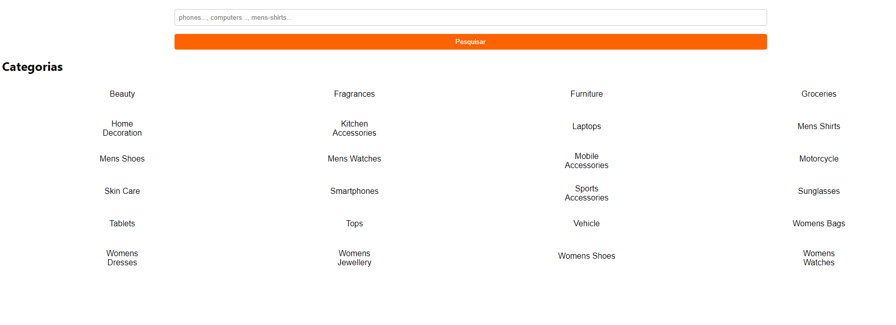
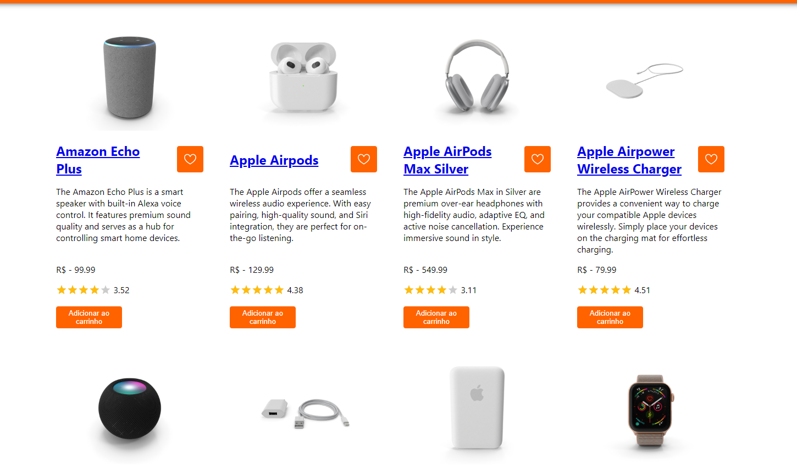
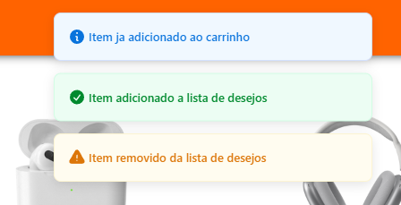
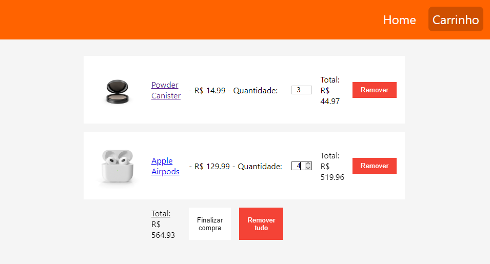
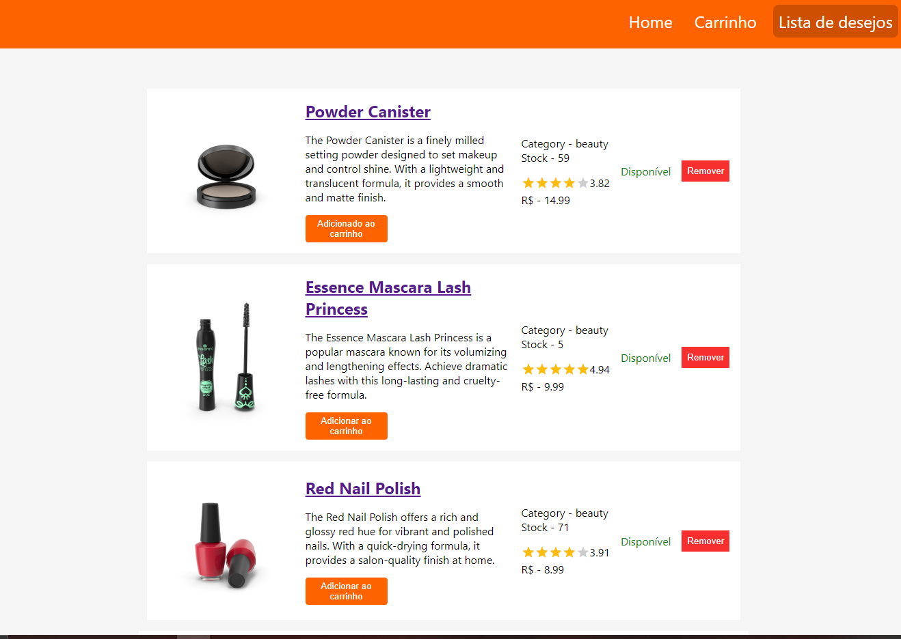
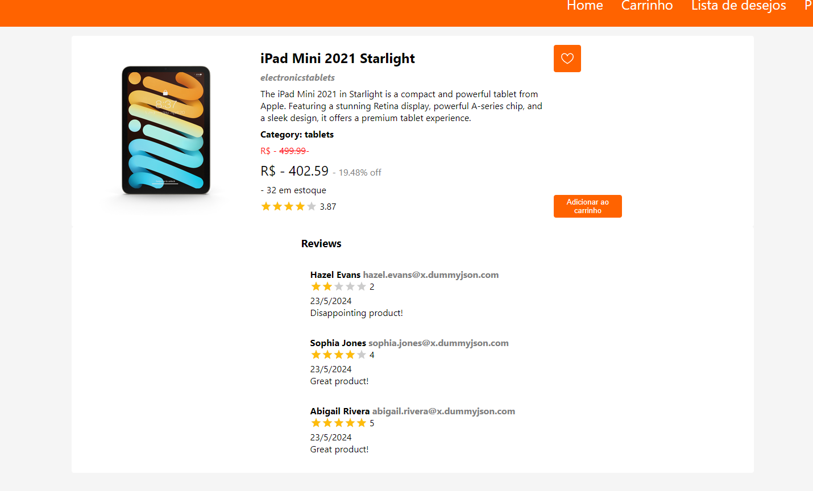

# [PRAZO DE ENTREGA - 7 DIAS CORRIDOS]

# Teste de Desenvolvimento - Plataforma de Comércio Eletrônico

Este projeto é parte de um teste de desenvolvimento para uma plataforma de comércio eletrônico. O objetivo é criar uma aplicação que inclua várias funcionalidades essenciais, como lista de desejos, carrinho de compras, gerenciamento de produtos, entre outros.

## Inicialização

- Faça um fork do repositório do projeto.
- Clone o repositório forkado para o seu ambiente local.
- Utilize _`yarn dev`_ para iniciar o frontend.
- Quando finalizado, envie o link do repositório para dev@acheipneus.com.br.

- A utilização dos templates é opcional

## Funcionalidades Principais

### Lista de Desejos e Carrinho de Compra

- Os usuários podem adicionar produtos à lista de desejos.
- Os usuários podem adicionar produtos ao carrinho de compras.

### Gerenciamento do Carrinho

- Os usuários podem visualizar e gerenciar os itens no carrinho de compras.

### Gerenciamento de Desejos

- Os usuários podem visualizar e gerenciar os itens em sua lista de desejos.

### Listagem de Produtos

- Página ou seção para listar todos os produtos disponíveis na plataforma.

### Ordenação dos Produtos

- Os produtos podem ser ordenados por diferentes critérios, como preço, popularidade, etc.

### Atributos dos Produtos

- Cada produto possui pelo menos 5 atributos associados a ele.

## Requisitos de Desenvolvimento

- **Sem Warnings ou Erros**: O código deve ser desenvolvido de forma a minimizar ou eliminar completamente qualquer aviso ou erro.
- **Lib de Gerenciamento de Estado**: Utilize Redux ou uma lib similar para o gerenciamento do estado da aplicação.
- **Lib Front-End**: Utilize React com componentes funcionais em TypeScript.
- **Versionamento e Conventional Commits**: Utilize Git/GitHub para versionamento do código e siga uma convenção para os comentários.
- **Utilizar JSON para produtos**

## Funcionamento da Aplicação

### Home page

Desde a página principal, ver as categorias dos produtos e uma barra pra pesquisar especificos

Ao clicar em qualquer botão referente a uma categoría, pode ver uma lista de produtos referentes a dita categoria

No momento de inteagir com os botões do aplicativo, uma memsagem vai aparecer no canto superior e central da tela, dependendo da função e da resposta, uma memsagem diferente vai aparecer.

Os usuarios podem conferir no carrinho acima no navbar os items adicionados ao mesmo, éste contém também a posibilidade de serem eliminados, pode adicionar mais unidades e o aplicativo vai calcular o preço

Na pagina da lista de desejos, o usuario pode visualizar seus items salvos, remove-los e adicionar ao carrinho direito, também podem ver se o item encontra-se disponível

Em qualquer momento que veja um produto em uma lista, o usuario pode clickar seja no nome quanto na imagem e pode ver mais detalhes e também comentarios dos anteriores compradores.

e gerenciar-los para o carrinho ou para a lista de desejos mesmo.

## Autor

#### Diego Andres Gonzalez Busnego

[Github](https://github.com/KingDiegato) - Telefone: +55 (47) 9677 3464

Email: gonzalezbusnegobr@gmail.com
